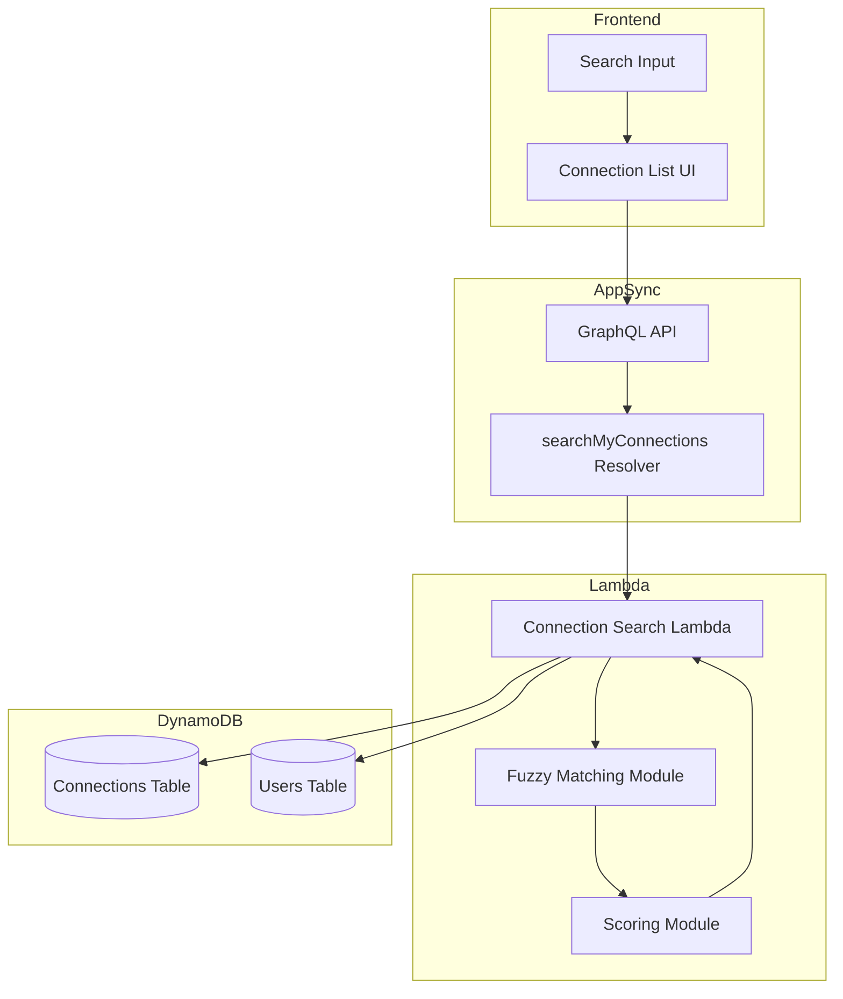

# Design Document: Connection Search

## Overview

This feature adds server-side search functionality for user connections in HallwayTrak. The search allows users to find connections by display name, tags, or
notes using fuzzy matching. Results are ranked by match quality, with exact matches scoring higher than fuzzy matches and multi-field matches scoring higher
than single-field matches.

The implementation uses a simple in-memory fuzzy matching algorithm that can be replaced with OpenSearch in the future without changing the GraphQL API
contract.

## Architecture



## Components and Interfaces

### GraphQL Schema Extensions

```graphql
type ConnectionSearchResult {
    connection: Connection!
    score: Float!
}

type SearchConnectionsResult {
    results: [ConnectionSearchResult!]!
    totalCount: Int!
}

extend type Query {
    searchMyConnections(query: String!): SearchConnectionsResult!
}
```

### Lambda Function: connection-search

The Lambda function handles the search logic:

1. Fetches all connections for the authenticated user
2. Fetches connected user profiles to get display names
3. Applies fuzzy matching against query for each connection
4. Calculates combined scores
5. Returns sorted results

### Fuzzy Matching Module

A simple fuzzy matching implementation using:

-   Case-insensitive comparison
-   Substring matching for partial matches
-   Levenshtein distance for typo tolerance
-   Word boundary bonuses for exact word matches

### Scoring Module

Calculates match scores based on:

-   Match type (exact = 1.0, substring = 0.8, fuzzy = 0.6)
-   Field weight (name = 1.0, tag = 0.9, note = 0.7)
-   Combined score = max(nameScore, tagScore, noteScore) + bonuses for multi-field matches

## Data Models

### ConnectionSearchResult

```typescript
interface ConnectionSearchResult {
    connection: Connection;
    score: number;
}
```

### SearchConnectionsResult

```typescript
interface SearchConnectionsResult {
    results: ConnectionSearchResult[];
    totalCount: number;
}
```

### Internal Scoring Types

```typescript
interface FieldMatch {
    field: 'name' | 'tag' | 'note';
    matchType: 'exact' | 'substring' | 'fuzzy';
    score: number;
}

interface ScoredConnection {
    connection: Connection;
    matches: FieldMatch[];
    totalScore: number;
}
```

## Correctness Properties

_A property is a characteristic or behavior that should hold true across all valid executions of a system-essentially, a formal statement about what the system
should do. Properties serve as the bridge between human-readable specifications and machine-verifiable correctness guarantees._

### Property 1: Name search returns fuzzy matches

_For any_ connection with a display name and _for any_ search query that is a fuzzy match to that name (exact, substring, or within edit distance), the search
results SHALL include that connection.

**Validates: Requirements 1.1, 1.2, 1.3**

### Property 2: Tag search returns all matching connections

_For any_ set of connections where multiple connections share a tag, and _for any_ search query that matches that tag, the search results SHALL include all
connections with that matching tag.

**Validates: Requirements 2.1, 2.2**

### Property 3: Note search returns fuzzy matches

_For any_ connection with a note and _for any_ search query that is a fuzzy match to text in that note, the search results SHALL include that connection.

**Validates: Requirements 3.1, 3.2**

### Property 4: Results are ordered by descending score

_For any_ search query that returns multiple results, the results SHALL be ordered such that for all adjacent pairs (result[i], result[i+1]), result[i].score >=
result[i+1].score.

**Validates: Requirements 4.1**

### Property 5: Multi-field matches rank higher than single-field matches

_For any_ two connections where one matches the query in multiple fields and another matches in only one field, the multi-field match SHALL have a higher score
than the single-field match.

**Validates: Requirements 4.2**

### Property 6: Exact matches rank higher than fuzzy matches

_For any_ two connections where one has an exact match to the query and another has only a fuzzy match, the exact match SHALL have a higher or equal score.

**Validates: Requirements 4.3**

### Property 7: Empty query returns all connections

_For any_ user with connections, when the search query is empty, the search results SHALL include all connections for that user.

**Validates: Requirements 5.1, 5.2**

## Error Handling

| Error Condition        | Handling Strategy                             |
| ---------------------- | --------------------------------------------- |
| User not authenticated | Return GraphQL authorization error            |
| DynamoDB read failure  | Return error with message, log details        |
| Invalid query (null)   | Treat as empty query, return all connections  |
| No connections found   | Return empty results array with totalCount: 0 |

## Testing Strategy

### Unit Tests

-   Test fuzzy matching algorithm with various inputs (exact, substring, typos)
-   Test scoring calculation for different match types
-   Test result sorting logic
-   Test edge cases (empty query, no matches, special characters)

### Property-Based Tests

Property-based tests will use fast-check library to verify the correctness properties:

1. **Property 1 Test**: Generate random connections and queries, verify fuzzy matches are returned
2. **Property 2 Test**: Generate connections with shared tags, verify all are returned
3. **Property 3 Test**: Generate connections with notes, verify note matches are returned
4. **Property 4 Test**: Generate search results, verify descending score order
5. **Property 5 Test**: Generate multi-field vs single-field matches, verify ranking
6. **Property 6 Test**: Generate exact vs fuzzy matches, verify ranking
7. **Property 7 Test**: Generate connections, verify empty query returns all

Each property-based test will be configured to run a minimum of 100 iterations and will be tagged with the format:
`**Feature: connection-search, Property {number}: {property_text}**`

### Integration Tests

-   Test full search flow through GraphQL API
-   Test with real DynamoDB connections
-   Verify response format matches schema
