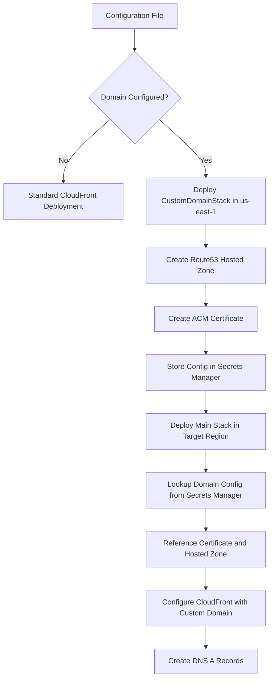

# Custom Domain Support Design

## Overview

This design implements optional custom domain support for the Hallway Track application by extending the existing CDK infrastructure. The solution leverages AWS Certificate Manager's cross-region certificate provisioning capabilities and integrates seamlessly with the existing CloudFront distribution setup.

## Architecture

### High-Level Components

1. **Configuration Extension**: Extend the existing `HallwayTrackConfig` interface to include optional domain settings
2. **Custom Domain Stack**: Separate CDK stack deployed in us-east-1 for Route53 and ACM resources
3. **Cross-Region Communication**: Use AWS Secrets Manager to share domain configuration between regions
4. **CloudFront Integration**: Main stack references domain resources and configures CloudFront distribution

### Component Interaction Flow



## Components and Interfaces

### Configuration Interface Extension

```typescript
export interface CustomDomainConfig {
  /**
   * The custom domain name for the application
   * Example: "hallwaytrack.com"
   *
   * When configured, both the apex domain and www subdomain will be supported
   */
  domainName?: string;
}

export interface HallwayTrackConfig {
  badges: BadgeConfig;
  customDomain?: CustomDomainConfig;
}
```

### CDK Stack Architecture

The implementation uses two CDK stacks:

1. **CustomDomainStack** (deployed in us-east-1):
   - Creates Route53 hosted zone
   - Creates ACM certificate with DNS validation
   - Stores configuration in Secrets Manager for cross-region access

2. **HallwayTrackStack** (deployed in target region):
   - Looks up domain configuration from Secrets Manager
   - References certificate and hosted zone from us-east-1
   - Configures CloudFront distribution with custom domain
   - Creates DNS A records pointing to CloudFront

### Key CDK Constructs

**CustomDomainStack (us-east-1):**
- `aws-certificatemanager.Certificate`: Creates certificate with DNS validation
- `aws-route53.HostedZone`: Creates DNS hosted zone for the custom domain
- `aws-secretsmanager.Secret`: Stores domain configuration with automatic replication to target region

**HallwayTrackStack (target region):**
- `aws-secretsmanager.Secret.fromSecretNameV2`: Looks up domain configuration
- `aws-route53.HostedZone.fromHostedZoneAttributes`: References hosted zone using ID from Secrets Manager
- `aws-certificatemanager.Certificate.fromCertificateArn`: References certificate using ARN from Secrets Manager
- `aws-route53.ARecord`: Creates DNS records pointing to CloudFront distribution
- `aws-cloudfront.Distribution`: Enhanced with `domainNames` and `certificate` properties

## Data Models

### Configuration Schema

```typescript
// Example configuration in config.ts
const accountConfigurations: AccountConfiguration = {
  "831926593673": {
    badges: { /* existing badge config */ },
    customDomain: {
      domainName: "hallwaytrack.com"
    }
  }
};
```

### CDK Resource Naming

- Hosted Zone: `CustomDomainHostedZone`
- Certificate: `CustomDomainCertificate`
- DNS Records: `CustomDomainARecord`, `CustomDomainWwwARecord`
- CloudFront Domain Names: `[domainName, www.domainName]`

## Error Handling

### Configuration Validation

1. **Domain Format Validation**: Ensure domain name follows valid DNS naming conventions
2. **Deployment Region Check**: Validate that certificate creation succeeds in us-east-1
3. **DNS Propagation**: Handle DNS validation timeouts gracefully with appropriate error messages

### Deployment Scenarios

1. **Missing Domain Configuration**: Deploy normally without custom domain resources
2. **Invalid Domain Format**: Fail fast with clear error message during CDK synthesis
3. **Certificate Validation Failure**: Provide clear instructions for manual DNS record creation if needed
4. **Existing Domain Conflict**: Handle cases where domain is already in use in another AWS account

### Error Recovery

- **Certificate Validation Timeout**: Provide manual validation instructions
- **DNS Propagation Issues**: Include troubleshooting steps in deployment output
- **CloudFront Distribution Update Failure**: Rollback to previous configuration

## Testing Strategy

### Unit Testing

- **Configuration Validation**: Test domain name format validation logic
- **Conditional Resource Creation**: Verify resources are only created when domain is configured
- **CDK Synthesis**: Ensure stack synthesizes correctly with and without custom domain

### Integration Testing

- **Certificate Creation**: Verify certificate is created in us-east-1 regardless of stack region
- **DNS Validation**: Test automatic DNS record creation and validation
- **CloudFront Configuration**: Verify distribution accepts custom domain and certificate

### Manual Testing Scenarios

1. **New Domain**: Deploy with a new domain name and verify full setup
2. **Existing Domain**: Test with domain already configured in Route53
3. **No Domain**: Verify existing functionality remains unchanged
4. **Domain Removal**: Test removing domain configuration and reverting to default

## Implementation Approach

### Phase 1: Configuration and Validation

1. Extend configuration interfaces and validation logic
2. Add domain format validation utilities
3. Update configuration loading to handle optional domain settings

### Phase 2: Certificate Management

1. Implement certificate creation using modern `Certificate` construct
2. Add Route53 hosted zone creation
3. Configure automatic DNS validation records

### Phase 3: CloudFront Integration

1. Conditionally modify existing CloudFront distribution configuration
2. Add domain names and certificate when custom domain is configured
3. Create DNS A records pointing to CloudFront distribution

### Phase 4: Output and Documentation

1. Add CloudFormation outputs for custom domain URL
2. Update deployment documentation with custom domain setup instructions
3. Add troubleshooting guide for common domain configuration issues

## Security Considerations

### Certificate Management

- **Automatic Validation**: Use DNS validation to avoid manual certificate approval
- **Certificate Renewal**: Leverage ACM's automatic renewal for managed certificates
- **Cross-Region Access**: Ensure certificate in us-east-1 is accessible from deployment region

### DNS Security

- **Hosted Zone Isolation**: Each deployment creates its own hosted zone
- **DNS Record Management**: Automatic record creation prevents manual configuration errors
- **Domain Ownership**: DNS validation ensures domain ownership before certificate issuance

## Performance Considerations

### Deployment Time

- **Certificate Provisioning**: DNS validation typically takes 5-10 minutes
- **CloudFront Propagation**: Distribution updates may take 15-20 minutes
- **DNS Propagation**: Full DNS propagation can take up to 48 hours globally

### Runtime Performance

- **No Performance Impact**: Custom domain uses same CloudFront distribution and caching
- **SSL Termination**: Certificate handling at CloudFront edge locations
- **DNS Resolution**: Route53 provides high-performance DNS resolution

## Monitoring and Observability

### CloudFormation Outputs

- Custom domain URL (when configured)
- Route53 hosted zone ID and name servers
- Certificate ARN for reference
- CloudFront distribution domain name (both custom and default)

### Deployment Logging

- Certificate validation progress
- DNS record creation status
- CloudFront distribution update progress
- Clear success/failure messages with next steps