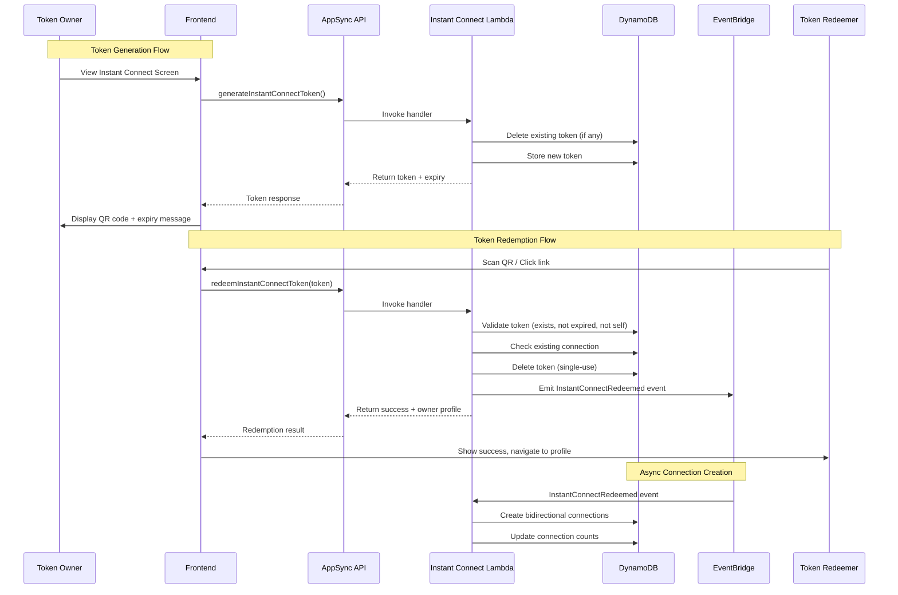

# Design Document: Instant Connect

## Overview

The Instant Connect feature provides a streamlined way for users to establish connections without the traditional request/approval flow. Users generate
short-lived, single-use tokens that can be shared via QR code or link. When another user redeems the token, a bidirectional connection is created immediately.

This feature complements the existing connection request system, which remains available for scenarios like search-based connections where approval is
appropriate.

## Architecture



## Components and Interfaces

### GraphQL Schema Extensions

```graphql
type InstantConnectToken {
    token: String!
    expiresAt: AWSDateTime!
    url: String!
}

type InstantConnectResult {
    success: Boolean!
    message: String
    connectedUser: PublicProfile
}

extend type Mutation {
    generateInstantConnectToken: InstantConnectToken!
    redeemInstantConnectToken(token: String!): InstantConnectResult!
}
```

### Lambda Handler: instant-connect

Handles both token generation and redemption:

**generateInstantConnectToken**

-   Validates authenticated user
-   Deletes any existing active token for the user
-   Generates cryptographically secure token (32 bytes, base64url encoded)
-   Stores token with 5-minute TTL
-   Returns token, expiry, and full URL

**redeemInstantConnectToken**

-   Validates authenticated user
-   Looks up token in DynamoDB
-   Validates: exists, not expired, not self-redemption, not already connected
-   Deletes token (single-use enforcement)
-   Emits InstantConnectRedeemed event to EventBridge
-   Returns success with owner's public profile

### Event Handler: instant-connect-redeemed

Processes the InstantConnectRedeemed event asynchronously:

-   Creates bidirectional connection records
-   Updates connection counts for both users
-   Updates leaderboard GSI for both users
-   (Badge events are triggered by DynamoDB streams)

### Frontend Components

**QRCodeDisplay** (modify existing component)

-   Replace static profile URL with instant connect token URL
-   Generate token on component mount
-   Display simple expiry message (e.g., "Expires in 5 minutes")
-   Auto-refresh token when expired (silent refresh)
-   Manual refresh button to generate new token
-   Reuse existing ShareProfileButton for sharing

**InstantConnectRedeem** (new route: /connect/:token)

-   Handles token redemption flow
-   Shows loading state during redemption
-   Displays success/error feedback
-   Redirects to connected profile on success
-   Handles unauthenticated users (redirect to login, then process)

## Data Models

### InstantConnectToken (DynamoDB)

Stored in a new `InstantConnectTokens` table:

| Attribute | Type   | Description                                            |
| --------- | ------ | ------------------------------------------------------ |
| PK        | String | `TOKEN#<token>` - enables direct lookup                |
| SK        | String | `TOKEN` - fixed value                                  |
| GSI1PK    | String | `USER#<userId>` - find user's active token             |
| GSI1SK    | String | `TOKEN` - fixed value                                  |
| token     | String | The token value (32 bytes, base64url)                  |
| userId    | String | Token owner's user ID                                  |
| createdAt | String | ISO timestamp                                          |
| expiresAt | String | ISO timestamp (createdAt + 5 minutes)                  |
| TTL       | Number | Unix timestamp for DynamoDB TTL (expiresAt + 24 hours) |

**Access Patterns:**

1. Get token by value: `PK = TOKEN#<token>`
2. Get user's active token: `GSI1PK = USER#<userId>`
3. Delete user's existing token before creating new one

### InstantConnectRedeemed Event

```typescript
interface InstantConnectRedeemedDetail {
    tokenOwnerId: string;
    redeemerId: string;
    timestamp: string;
}
```

## Correctness Properties

_A property is a characteristic or behavior that should hold true across all valid executions of a system-essentially, a formal statement about what the system
should do. Properties serve as the bridge between human-readable specifications and machine-verifiable correctness guarantees._

### Property 1: Token entropy is sufficient

_For any_ generated instant connect token, the token string SHALL have at least 128 bits of entropy (minimum 22 base64url characters from 32 random bytes).
**Validates: Requirements 1.1, 6.1**

### Property 2: Token expiry is consistent

_For any_ generated instant connect token, the expiresAt timestamp SHALL be exactly 5 minutes (300 seconds) after the createdAt timestamp. **Validates:
Requirements 1.2**

### Property 3: Only one active token per user

_For any_ user who generates multiple instant connect tokens in sequence, only the most recently generated token SHALL be valid for redemption. **Validates:
Requirements 1.3**

### Property 4: Token data completeness

_For any_ generated instant connect token, the response SHALL include the token value, expiresAt timestamp, and a valid URL, AND the stored record SHALL include
userId, createdAt, and expiresAt. **Validates: Requirements 1.4, 1.5**

### Property 5: Redemption creates bidirectional connections

_For any_ successful token redemption between two users A and B, both users SHALL have a connection record pointing to the other user. **Validates: Requirements
2.1**

### Property 6: Tokens are single-use

_For any_ instant connect token that has been successfully redeemed, subsequent redemption attempts SHALL fail with an invalid token error. **Validates:
Requirements 2.2, 2.4**

### Property 7: Redemption triggers badge evaluation

_For any_ successful token redemption, the system SHALL emit an event that triggers badge evaluation for both the token owner and the redeemer. **Validates:
Requirements 2.7**

### Property 8: Instant connect URL format

_For any_ generated instant connect token, the URL SHALL be in the format `{origin}/connect/{token}` where token is the base64url-encoded token value.
**Validates: Requirements 3.1, 4.1**

### Property 9: Expiry message accuracy

_For any_ token with a known expiresAt timestamp, the displayed expiry message SHALL correctly indicate the token validity period (e.g., "Expires in 5
minutes"). **Validates: Requirements 3.2**

### Property 10: Redemption response includes owner profile

_For any_ successful token redemption, the response SHALL include the token owner's display name and public profile information. **Validates: Requirements 5.1**

### Property 11: Distinct error messages for failure scenarios

_For any_ failed token redemption, the error message SHALL distinguish between: expired token, invalid/used token, self-redemption, and already-connected
scenarios. **Validates: Requirements 5.3**

## Error Handling

| Scenario            | Error Message                                | HTTP Status |
| ------------------- | -------------------------------------------- | ----------- |
| Token not found     | "Invalid or expired connection link"         | 400         |
| Token expired       | "This connection link has expired"           | 400         |
| Self-redemption     | "You cannot connect with yourself"           | 400         |
| Already connected   | "You are already connected with this user"   | 400         |
| Rate limit exceeded | "Too many requests. Please try again later." | 429         |
| Unauthenticated     | Redirect to login                            | 401         |

## Testing Strategy

### Property-Based Testing

We will use **fast-check** for property-based testing in TypeScript.

Each property-based test will:

-   Run a minimum of 100 iterations
-   Be tagged with the corresponding correctness property
-   Use smart generators that constrain inputs to valid ranges

**Key properties to test:**

-   Token generation produces sufficient entropy (Property 1)
-   Token expiry calculation is correct (Property 2)
-   Single active token per user (Property 3)
-   Bidirectional connection creation (Property 5)
-   Single-use enforcement (Property 6)
-   URL format correctness (Property 8)
-   Error message distinctness (Property 11)

### Unit Tests

Unit tests will cover:

-   Token validation logic (expiry check, ownership check)
-   URL construction
-   Countdown timer calculation
-   Error message mapping

### Integration Tests

Integration tests will verify:

-   End-to-end token generation and redemption flow
-   Event emission and async connection creation
-   Rate limiting behavior
-   TTL cleanup (with accelerated time)
