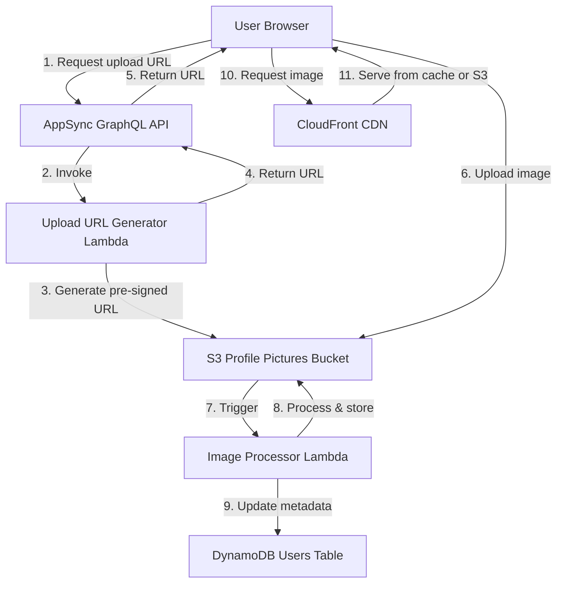

# Design Document: Profile Picture Upload

## Overview

This feature enables users to upload custom profile pictures to their Hallway Track profiles. The system will store uploaded images in Amazon S3, process them
for optimal display, and serve them via CloudFront CDN. The uploaded picture takes precedence over Google profile pictures and Gravatar in the display
hierarchy.

The implementation follows the existing serverless architecture using AWS Lambda for image processing, S3 for storage, CloudFront for content delivery, and
DynamoDB for metadata storage. The frontend will provide an intuitive upload interface with preview capabilities.

## Architecture

### High-Level Flow

1. User selects an image file in the frontend
2. Frontend displays preview and validates file type/size
3. User confirms upload
4. Frontend requests a pre-signed S3 upload URL from AppSync
5. Frontend uploads image directly to S3 using pre-signed URL
6. S3 triggers Lambda function for image processing
7. Lambda resizes/optimizes image and stores processed version
8. Lambda updates DynamoDB with profile picture metadata
9. Frontend displays the new profile picture
10. CloudFront serves cached images for subsequent requests

### Component Diagram



## Components and Interfaces

### 1. S3 Bucket for Profile Pictures

**Purpose**: Store original and processed profile pictures

**Configuration**:

-   Bucket name: `hallway-track-profile-pictures-{accountId}`
-   Encryption: Server-side encryption (S3-managed keys)
-   Public access: Blocked (access via CloudFront only)
-   Lifecycle policy: None (retain all images)
-   CORS: Enabled for direct browser uploads

**Folder Structure**:

```
/originals/{userId}/{timestamp}-{filename}
/processed/{userId}/{timestamp}-{filename}.webp
```

### 2. CloudFront Distribution for Profile Pictures

**Purpose**: Serve profile pictures with low latency and caching

**Configuration**:

-   Origin: S3 profile pictures bucket with Origin Access Control
-   Cache behavior: Cache optimized for images
-   Cache TTL: 1 day default, 1 year maximum
-   Compression: Enabled
-   Price class: PRICE_CLASS_100 (US, Canada, Europe)

### 3. GraphQL Schema Extensions

**New Mutations**:

```graphql
type Mutation {
    # Generate pre-signed URL for uploading profile picture
    generateProfilePictureUploadUrl(filename: String!, contentType: String!): ProfilePictureUploadUrl!

    # Remove uploaded profile picture
    removeProfilePicture: User!
}

type ProfilePictureUploadUrl {
    uploadUrl: String!
    key: String!
    expiresIn: Int!
}
```

**Schema Changes**:

```graphql
type User {
    # ... existing fields ...
    uploadedProfilePictureUrl: String # New field for uploaded picture
}

type PublicProfile {
    # ... existing fields ...
    uploadedProfilePictureUrl: String # New field for uploaded picture
}

type ConnectedProfile {
    # ... existing fields ...
    uploadedProfilePictureUrl: String # New field for uploaded picture
}
```

### 4. Upload URL Generator Lambda

**Purpose**: Generate pre-signed S3 URLs for secure direct uploads

**Runtime**: Node.js 20.x **Timeout**: 10 seconds **Memory**: 256 MB

**Input** (from AppSync):

```typescript
interface GenerateUploadUrlInput {
    filename: string;
    contentType: string;
    userId: string; // From Cognito context
}
```

**Output**:

```typescript
interface GenerateUploadUrlOutput {
    uploadUrl: string;
    key: string;
    expiresIn: number; // seconds
}
```

**Logic**:

1. Validate content type (image/jpeg, image/png, image/webp, image/gif)
2. Generate unique S3 key: `originals/{userId}/{timestamp}-{sanitizedFilename}`
3. Create pre-signed PUT URL with 5-minute expiration
4. Return URL and key to frontend

**Environment Variables**:

-   `PROFILE_PICTURES_BUCKET_NAME`
-   `USERS_TABLE_NAME`

### 5. Image Processor Lambda

**Purpose**: Process uploaded images for optimal display

**Runtime**: Node.js 20.x with Sharp library **Timeout**: 2 minutes **Memory**: 1024 MB **Trigger**: S3 event notification on `originals/` prefix

**Processing Steps**:

1. Download original image from S3
2. Validate image (check dimensions, file integrity)
3. Resize to 512x512 max dimension (maintain aspect ratio)
4. Convert to WebP format for optimal compression
5. Upload processed image to `processed/` folder
6. Update DynamoDB Users table with new profile picture URL
7. Invalidate CloudFront cache for old profile picture (if exists)

**Environment Variables**:

-   `PROFILE_PICTURES_BUCKET_NAME`
-   `USERS_TABLE_NAME`
-   `CLOUDFRONT_DISTRIBUTION_ID`

### 6. Remove Profile Picture Lambda

**Purpose**: Delete uploaded profile picture and revert to fallback

**Runtime**: Node.js 20.x **Timeout**: 30 seconds **Memory**: 256 MB

**Logic**:

1. Get user's current profile picture metadata from DynamoDB
2. Delete original and processed images from S3
3. Update DynamoDB to remove uploadedProfilePictureUrl
4. Invalidate CloudFront cache
5. Return updated user object

**Environment Variables**:

-   `PROFILE_PICTURES_BUCKET_NAME`
-   `USERS_TABLE_NAME`
-   `CLOUDFRONT_DISTRIBUTION_ID`

### 7. Frontend Upload Component

**Component**: `ProfilePictureUpload.tsx`

**Features**:

-   File input with drag-and-drop support
-   Client-side validation (file type, size)
-   Image preview with circular crop
-   Upload progress indicator
-   Error handling and user feedback

**State Management**:

```typescript
interface UploadState {
    selectedFile: File | null;
    previewUrl: string | null;
    uploading: boolean;
    progress: number;
    error: string | null;
}
```

**Upload Flow**:

1. User selects file
2. Validate file (type, size ≤ 5MB)
3. Generate preview using FileReader
4. Display preview in modal
5. On confirm:
    - Call `generateProfilePictureUploadUrl` mutation
    - Upload file to S3 using pre-signed URL
    - Poll for processing completion (check DynamoDB)
    - Update UI with new profile picture

### 8. Frontend ProfilePicture Component Updates

**Current Logic**:

```typescript
// Priority: Google profile picture → Gravatar
const imageUrl = profilePictureUrl && !imageError ? profilePictureUrl : getGravatarUrl(gravatarHash, size);
```

**New Logic**:

```typescript
// Priority: Uploaded → Google profile picture → Gravatar
const imageUrl =
    uploadedProfilePictureUrl && !uploadedError
        ? uploadedProfilePictureUrl
        : profilePictureUrl && !googleError
        ? profilePictureUrl
        : getGravatarUrl(gravatarHash, size);
```

## Data Models

### DynamoDB Users Table Updates

**New Attributes**:

```typescript
interface UserItem {
    // ... existing attributes ...
    uploadedProfilePictureUrl?: string; // CloudFront URL to processed image
    uploadedProfilePictureKey?: string; // S3 key for cleanup
    profilePictureUploadedAt?: string; // ISO timestamp
}
```

**Access Pattern**: No new access patterns needed (existing PK/SK structure supports this)

### S3 Object Metadata

**Original Image**:

```
Key: originals/{userId}/{timestamp}-{filename}
Metadata:
  - userId: {userId}
  - uploadedAt: {ISO timestamp}
  - originalFilename: {filename}
```

**Processed Image**:

```
Key: processed/{userId}/{timestamp}-{filename}.webp
Metadata:
  - userId: {userId}
  - processedAt: {ISO timestamp}
  - originalKey: originals/{userId}/{timestamp}-{filename}
  - dimensions: 512x512
```

##

Correctness Properties

_A property is a characteristic or behavior that should hold true across all valid executions of a system—essentially, a formal statement about what the system
should do. Properties serve as the bridge between human-readable specifications and machine-verifiable correctness guarantees._

### Upload Validation Properties

**Property 1: File type validation** _For any_ file object, the validation function should accept only files with MIME types image/jpeg, image/png, image/webp,
or image/gif, and reject all others **Validates: Requirements 1.1**

**Property 2: File size validation** _For any_ file object, the validation function should accept files with size ≤ 5MB and reject files with size > 5MB
**Validates: Requirements 1.2**

**Property 3: Upload uniqueness** _For any_ set of uploads by the same or different users, each upload should generate a unique S3 key that does not collide
with existing keys **Validates: Requirements 1.3**

**Property 4: Database update on successful upload** _For any_ successful image upload, the Users table should be updated with the S3 object key for that user
**Validates: Requirements 1.4**

**Property 5: State preservation on upload failure** _For any_ upload failure, the user's profile picture URL in the database should remain unchanged from its
pre-upload state **Validates: Requirements 1.5**

### Display Precedence Properties

**Property 6: Uploaded picture display consistency** _For any_ user with an uploaded profile picture, all profile views (own profile, public profile, connected
profile, connection lists) should display the uploaded picture URL **Validates: Requirements 2.1**

**Property 7: Uploaded over Google precedence** _For any_ user with both uploadedProfilePictureUrl and profilePictureUrl (Google) set, the display function
should return the uploadedProfilePictureUrl **Validates: Requirements 2.2**

**Property 8: Uploaded over Gravatar precedence** _For any_ user with uploadedProfilePictureUrl set and no profilePictureUrl, the display function should return
the uploadedProfilePictureUrl instead of generating a Gravatar URL **Validates: Requirements 2.3**

**Property 9: Google fallback when no upload** _For any_ user with no uploadedProfilePictureUrl but with profilePictureUrl (Google) set, the display function
should return the profilePictureUrl **Validates: Requirements 2.4**

### Removal Properties

**Property 10: S3 cleanup on removal** _For any_ profile picture removal operation, both the original and processed images should be deleted from S3
**Validates: Requirements 3.1**

**Property 11: Database cleanup on removal** _For any_ profile picture removal operation, the uploadedProfilePictureUrl and uploadedProfilePictureKey fields
should be removed from the user's DynamoDB record **Validates: Requirements 3.2**

**Property 12: Fallback after removal** _For any_ user who removes their uploaded picture, the display function should immediately return the next available
picture source (Google or Gravatar) according to precedence **Validates: Requirements 3.3**

**Property 13: State preservation on removal failure** _For any_ removal operation that fails, the user's uploadedProfilePictureUrl should remain unchanged in
the database **Validates: Requirements 3.4**

### Image Processing Properties

**Property 14: Resize with aspect ratio preservation** _For any_ uploaded image, the processed version should have maximum dimension of 512 pixels, and the
aspect ratio should match the original image's aspect ratio **Validates: Requirements 4.1**

**Property 15: WebP format conversion** _For any_ uploaded image regardless of input format (JPEG, PNG, GIF), the processed version should be in WebP format
**Validates: Requirements 4.2**

**Property 16: Dual storage of images** _For any_ completed image processing operation, both an original image and a processed image should exist in S3
**Validates: Requirements 4.3**

**Property 17: Optimized version serving** _For any_ profile picture display request where a processed version exists, the system should serve the processed
version URL **Validates: Requirements 4.4**

### Preview Properties

**Property 18: Preview display on selection** _For any_ valid image file selection, the UI should display a preview of that image **Validates: Requirements
5.1**

**Property 19: Circular crop preview** _For any_ preview display, the image should be rendered with circular cropping **Validates: Requirements 5.2**

**Property 20: Cancel preserves state** _For any_ preview cancellation, the selected file should be discarded and the current profile picture should remain
unchanged **Validates: Requirements 5.4**

### Security Properties

**Property 21: S3 encryption enforcement** _For any_ profile picture stored in S3, the object should have server-side encryption enabled **Validates:
Requirements 6.1**

**Property 22: User ID in S3 keys** _For any_ generated S3 object key, the key should contain the user ID as part of its path structure **Validates:
Requirements 6.2**

**Property 23: Signed URL expiration** _For any_ generated pre-signed URL, the URL should have an expiration time set (non-infinite TTL) **Validates:
Requirements 6.3**

**Property 24: Account deletion cleanup** _For any_ user account deletion, all profile pictures (original and processed) associated with that user ID should be
removed from S3 **Validates: Requirements 6.4**

**Property 25: Authorization enforcement** _For any_ upload or delete operation, the system should verify that the authenticated user ID matches the user ID in
the operation, rejecting mismatches **Validates: Requirements 6.5**

### Performance Properties

**Property 26: CloudFront URL usage** _For any_ profile picture URL returned to the frontend, the URL should use the CloudFront distribution domain, not the S3
bucket domain **Validates: Requirements 7.1**

**Property 27: Cache headers presence** _For any_ profile picture HTTP response, the response should include Cache-Control headers **Validates: Requirements
7.2**

**Property 28: Cache invalidation on update** _For any_ profile picture update operation, a CloudFront cache invalidation should be triggered for the old image
URL **Validates: Requirements 7.3**

**Property 29: Lazy loading in lists** _For any_ component that displays a list of profile pictures, the images should be loaded using lazy loading attributes
or techniques **Validates: Requirements 7.4**

## Error Handling

### Client-Side Errors

**File Validation Errors**:

-   Invalid file type: "Please select a valid image file (JPEG, PNG, WebP, or GIF)"
-   File too large: "Image file must be smaller than 5MB. Your file is {size}MB"
-   File read error: "Unable to read the selected file. Please try again"

**Upload Errors**:

-   Network failure: "Upload failed due to network error. Please check your connection and try again"
-   S3 upload failure: "Failed to upload image. Please try again"
-   Timeout: "Upload is taking longer than expected. Please try again with a smaller file"

**Processing Errors**:

-   Processing timeout: "Image processing is taking longer than expected. Please refresh to see if your picture was updated"
-   Processing failure: "Failed to process your image. Please try a different image"

### Server-Side Errors

**Lambda Errors**:

-   Invalid content type: Return 400 with message "Unsupported image format"
-   Missing user context: Return 401 with message "Authentication required"
-   S3 operation failure: Return 500 with message "Failed to store image"
-   DynamoDB operation failure: Return 500 with message "Failed to update profile"
-   Image processing failure: Log error, send notification, leave original image

**Error Recovery**:

-   Failed uploads: No cleanup needed (pre-signed URL expires)
-   Failed processing: Retry up to 3 times with exponential backoff
-   Failed DynamoDB updates: Retry with exponential backoff, alert on persistent failure
-   Failed S3 deletions: Log for manual cleanup, don't block user operation

### Error Monitoring

**CloudWatch Alarms**:

-   Image processor Lambda error rate > 5% over 5 minutes
-   Upload URL generator Lambda error rate > 5% over 5 minutes
-   S3 bucket 4xx/5xx error rate > 10% over 5 minutes
-   DynamoDB throttling events

**Logging**:

-   All Lambda invocations with request ID
-   S3 operations with user ID and object key
-   DynamoDB operations with user ID
-   Processing failures with image metadata

## Testing Strategy

### Unit Testing

**Frontend Components**:

-   File validation logic (type, size)
-   Preview generation from File object
-   Upload progress tracking
-   Error message display
-   Profile picture precedence logic

**Lambda Functions**:

-   Pre-signed URL generation
-   S3 key generation and uniqueness
-   Image processing (resize, format conversion)
-   DynamoDB update operations
-   CloudFront invalidation calls

**Utilities**:

-   File type detection
-   Image dimension calculation
-   Aspect ratio preservation
-   URL parsing and validation

### Property-Based Testing

Property-based tests will use **fast-check** library for TypeScript/JavaScript to verify universal properties across randomly generated inputs.

**Configuration**: Each property test should run a minimum of 100 iterations.

**Test Tagging**: Each property-based test must include a comment with the format: `// Feature: profile-picture-upload, Property {number}: {property_text}`

**Upload Validation Tests**:

-   Property 1: File type validation (generate random MIME types)
-   Property 2: File size validation (generate random file sizes)
-   Property 3: Upload uniqueness (generate multiple uploads)
-   Property 4: Database update on success (generate random uploads)
-   Property 5: State preservation on failure (simulate failures)

**Display Precedence Tests**:

-   Property 6: Uploaded picture display consistency (generate user states)
-   Property 7: Uploaded over Google precedence (generate dual-picture states)
-   Property 8: Uploaded over Gravatar precedence (generate states)
-   Property 9: Google fallback (generate no-upload states)

**Removal Tests**:

-   Property 10: S3 cleanup on removal (generate removal operations)
-   Property 11: Database cleanup on removal (generate removal operations)
-   Property 12: Fallback after removal (generate various user states)
-   Property 13: State preservation on removal failure (simulate failures)

**Image Processing Tests**:

-   Property 14: Resize with aspect ratio (generate images of various dimensions)
-   Property 15: WebP conversion (generate images in different formats)
-   Property 16: Dual storage (verify both versions exist)
-   Property 17: Optimized serving (generate display requests)

**Preview Tests**:

-   Property 18: Preview display (generate file selections)
-   Property 19: Circular crop (verify preview rendering)
-   Property 20: Cancel preserves state (generate cancel operations)

**Security Tests**:

-   Property 21: S3 encryption (verify all stored objects)
-   Property 22: User ID in keys (generate S3 keys)
-   Property 23: Signed URL expiration (generate URLs)
-   Property 24: Account deletion cleanup (simulate deletions)
-   Property 25: Authorization enforcement (generate unauthorized attempts)

**Performance Tests**:

-   Property 26: CloudFront URL usage (verify returned URLs)
-   Property 27: Cache headers (verify HTTP responses)
-   Property 28: Cache invalidation (verify update operations)
-   Property 29: Lazy loading (verify list components)

### Integration Testing

**End-to-End Upload Flow**:

1. Generate upload URL via GraphQL
2. Upload image to S3
3. Wait for processing completion
4. Verify processed image exists
5. Verify DynamoDB updated
6. Verify image displays in UI

**End-to-End Removal Flow**:

1. Upload a profile picture
2. Remove the profile picture via GraphQL
3. Verify S3 objects deleted
4. Verify DynamoDB updated
5. Verify fallback image displays

**Precedence Testing**:

1. Test all combinations of picture sources
2. Verify correct precedence in each case
3. Test transitions between states

**Error Scenarios**:

1. Upload with invalid file type
2. Upload with oversized file
3. Simulate S3 failure
4. Simulate processing failure
5. Verify error handling and recovery

### Manual Testing Checklist

-   [ ] Upload JPEG, PNG, WebP, and GIF images
-   [ ] Upload image larger than 5MB (should fail)
-   [ ] Upload non-image file (should fail)
-   [ ] Preview displays correctly before upload
-   [ ] Cancel upload preserves current picture
-   [ ] Uploaded picture displays in all views
-   [ ] Remove picture reverts to Google/Gravatar
-   [ ] Processed image is smaller than original
-   [ ] Images load quickly via CloudFront
-   [ ] Lazy loading works in connection lists
-   [ ] Mobile responsive upload interface
-   [ ] Drag-and-drop file selection works
-   [ ] Upload progress indicator displays
-   [ ] Error messages are clear and helpful

## Implementation Notes

### Dependencies

**Frontend**:

-   No new dependencies (use native File API and fetch)

**Backend**:

-   `sharp` library for image processing (already available in Lambda)
-   `@aws-sdk/client-s3` for S3 operations
-   `@aws-sdk/s3-request-presigner` for pre-signed URLs
-   `@aws-sdk/client-cloudfront` for cache invalidation

### Performance Considerations

**Image Processing**:

-   Process images asynchronously (don't block user)
-   Use Lambda with sufficient memory (1024 MB) for Sharp
-   Consider Lambda timeout for large images (2 minutes)

**Caching**:

-   CloudFront cache TTL: 1 day default
-   Browser cache: Use Cache-Control headers
-   Invalidate cache only on updates (not on every view)

**Storage**:

-   Store both original and processed versions
-   Original for future reprocessing if needed
-   Processed for optimal delivery

### Security Considerations

**Upload Security**:

-   Pre-signed URLs expire after 5 minutes
-   Validate content type on both client and server
-   Limit file size to prevent abuse
-   Use user ID in S3 key to prevent overwrites

**Access Control**:

-   S3 bucket not publicly accessible
-   CloudFront Origin Access Control for S3
-   AppSync authorization via Cognito
-   Verify user owns profile before operations

**Data Privacy**:

-   Profile pictures are public (visible to connections)
-   Users can remove pictures at any time
-   Account deletion removes all pictures

### Scalability Considerations

**S3 Storage**:

-   No practical limit on number of objects
-   Cost scales linearly with storage
-   Consider lifecycle policies for old images (future)

**Lambda Concurrency**:

-   Image processor may need reserved concurrency
-   Upload URL generator is lightweight
-   Monitor throttling metrics

**CloudFront**:

-   Global edge locations for low latency
-   Automatic scaling for traffic spikes
-   Monitor cache hit ratio

### Migration Considerations

**Existing Users**:

-   No migration needed (new optional feature)
-   Existing Google/Gravatar pictures continue working
-   Users opt-in by uploading

**Rollback Plan**:

-   Feature can be disabled by removing mutations
-   Existing uploaded pictures remain in S3
-   Users fall back to Google/Gravatar automatically

## Future Enhancements

**Image Editing**:

-   Crop and rotate before upload
-   Filters and adjustments
-   Multiple aspect ratios

**Advanced Processing**:

-   Generate multiple sizes (thumbnail, medium, large)
-   Face detection and auto-crop
-   Background removal

**Storage Optimization**:

-   Lifecycle policies to archive old images
-   Automatic cleanup of unused images
-   Compression optimization

**User Experience**:

-   Webcam capture option
-   Import from social media
-   Profile picture history/gallery
