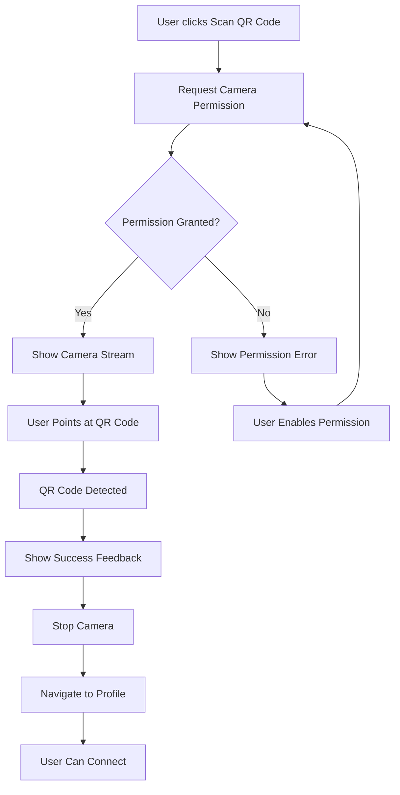

# QR Code Scanner Design Document

## Overview

This feature adds in-app QR code scanning capability to the Hallway Track application using the browser's native camera access via the MediaDevices API. The scanner will decode QR codes containing profile URLs and automatically navigate users to the scanned profile, enabling quick connections at events without leaving the app.

The implementation will use the `html5-qrcode` library, which provides a robust, cross-browser QR code scanning solution with built-in camera management and error handling.

## Architecture

### Component Structure

```
QRCodeScanner (new component)
├── Camera initialization and management
├── QR code detection and decoding
├── Result processing and navigation
└── Error handling and user feedback
```

### Integration Points

1. **Navigation**: Add scanner link to AppNav component
2. **Routing**: Add `/scan` route in App.tsx
3. **Profile Navigation**: Use existing PublicProfile component for displaying scanned profiles
4. **Connection Flow**: Leverage existing ConnectButton component on profile pages

### Library Selection

**html5-qrcode** (https://github.com/mebjas/html5-qrcode)
- Mature, actively maintained library
- Cross-browser support (Chrome, Firefox, Safari, Edge)
- Built-in camera management and permissions handling
- Mobile and desktop support
- TypeScript definitions available
- No native dependencies (pure JavaScript)

## Components and Interfaces

### QRCodeScanner Component

**Location**: `frontend/src/components/QRCodeScanner.tsx`

**Props**: None (standalone component)

**State**:
```typescript
interface ScannerState {
  isScanning: boolean;
  error: string | null;
  cameraId: string | null;
  cameras: CameraDevice[];
  scanResult: string | null;
}

interface CameraDevice {
  id: string;
  label: string;
}
```

**Key Methods**:
- `initializeScanner()`: Set up html5-qrcode instance and request camera permissions
- `startScanning()`: Begin camera stream and QR detection
- `stopScanning()`: Stop camera stream and cleanup resources
- `handleScanSuccess(decodedText: string)`: Process successful scan and navigate
- `handleScanError(error: string)`: Handle scanning errors
- `switchCamera(cameraId: string)`: Switch between available cameras
- `extractProfileId(url: string)`: Parse profile ID from QR code URL

**Lifecycle**:
1. Component mounts → Initialize scanner
2. Request camera permission
3. On permission granted → Start scanning
4. On QR detected → Stop scanning, process result, navigate
5. Component unmounts → Cleanup camera resources

### Navigation Integration

**AppNav Component Updates**:
- Add "Scan QR Code" link between "My QR Code" and existing links
- Icon: 📷 or similar camera emoji
- Route: `/scan`

**App.tsx Route Addition**:
```typescript
<Route path="/scan" element={
  <ProtectedRoute>
    <QRCodeScanner />
  </ProtectedRoute>
} />
```

### Dashboard Quick Action (Optional Enhancement)

Add a quick action card on the Dashboard for easy scanner access:
```typescript
<Link to="/scan" className="action-card">
  <div className="action-card-icon">📷</div>
  <h3>Scan QR Code</h3>
  <p>Scan another attendee's QR code to connect</p>
</Link>
```

## Data Models

### QR Code URL Format

The scanner expects QR codes to contain profile URLs in the format:
```
https://{domain}/profile/{userId}
```

**Parsing Logic**:
```typescript
function extractProfileId(scannedUrl: string): string | null {
  try {
    const url = new URL(scannedUrl);
    const pathMatch = url.pathname.match(/^\/profile\/([a-zA-Z0-9-]+)$/);
    return pathMatch ? pathMatch[1] : null;
  } catch {
    return null;
  }
}
```

### Camera Configuration

```typescript
interface Html5QrcodeConfig {
  fps: 10; // Frames per second for scanning
  qrbox: { width: 250, height: 250 }; // Scanning box dimensions
  aspectRatio: 1.0; // Square aspect ratio
}
```

## Error Handling

### Error Types and User Messages

1. **Camera Permission Denied**
   - Message: "Camera access is required to scan QR codes. Please enable camera permissions in your browser settings."
   - Action: Show instructions for enabling camera access
   - Recovery: Provide retry button

2. **No Camera Available**
   - Message: "No camera detected. Please ensure your device has a camera and it's not being used by another application."
   - Action: None (informational only)

3. **Invalid QR Code**
   - Message: "This QR code doesn't appear to be a valid Hallway Track profile. Please scan a profile QR code."
   - Action: Allow user to scan again
   - Recovery: Automatically return to scanning mode after 2 seconds

4. **Network Error (Profile Loading)**
   - Message: "Unable to load profile. Please check your connection and try again."
   - Action: Provide retry button
   - Recovery: Return to scanner on retry

5. **Camera Initialization Error**
   - Message: "Unable to initialize camera. Please try again or use a different browser."
   - Action: Provide retry button

### Error Display Component

Reuse existing `ErrorMessage` component for consistency:
```typescript
<ErrorMessage
  message={error}
  onRetry={handleRetry}
  onDismiss={() => setError(null)}
/>
```

## User Experience Flow

### Successful Scan Flow



### Visual Feedback States

1. **Loading State**: Show spinner while initializing camera
2. **Scanning State**: Show camera stream with scanning overlay
3. **Processing State**: Brief visual confirmation when QR detected
4. **Success State**: Checkmark or success message before navigation
5. **Error State**: Error message with retry option

## Mobile Considerations

### Camera Selection

- **Default**: Use rear camera on mobile devices (environment-facing)
- **Fallback**: Front camera if rear not available
- **Toggle**: Provide camera switch button for user preference

### Responsive Design

- **Portrait Mode**: Full-width camera view with controls below
- **Landscape Mode**: Adjust layout to maintain usability
- **Scanning Box**: Scale appropriately for screen size
- **Touch Targets**: Ensure buttons are at least 44x44px for mobile

### Performance

- **Frame Rate**: 10 FPS to balance detection speed and battery usage
- **Resolution**: Use appropriate resolution for QR detection (not maximum)
- **Cleanup**: Properly stop camera stream when component unmounts

## Desktop Considerations

### Webcam Support

- **Camera Selection**: Dropdown to select from multiple cameras
- **Layout**: Center camera view with appropriate sizing
- **Instructions**: Clear guidance for positioning QR codes

### Browser Compatibility

- **Chrome/Edge**: Full support via MediaDevices API
- **Firefox**: Full support via MediaDevices API
- **Safari**: Requires HTTPS (already enforced by CloudFront)

## Testing Strategy

### Manual Testing Focus

Given the minimal testing approach, focus on:

1. **Core Functionality**
   - Camera initialization on mobile and desktop
   - QR code detection and decoding
   - Navigation to correct profile after scan
   - Camera cleanup on component unmount

2. **Error Scenarios**
   - Permission denied handling
   - Invalid QR code handling
   - Network error during profile load

3. **Cross-Browser Testing**
   - Test on Chrome (mobile and desktop)
   - Test on Safari (iOS and macOS)
   - Test on Firefox (desktop)

4. **Device Testing**
   - iOS Safari (primary mobile target)
   - Android Chrome (secondary mobile target)
   - Desktop browsers (Chrome, Firefox, Safari)

### Test Cases

1. Scan valid profile QR code → Navigate to profile
2. Scan invalid QR code → Show error, allow retry
3. Deny camera permission → Show error with instructions
4. Switch between cameras → Camera changes correctly
5. Navigate away while scanning → Camera stops properly
6. Scan QR code on mobile → Uses rear camera by default
7. Scan QR code on desktop → Shows camera selection

## Implementation Notes

### Package Installation

```bash
npm install html5-qrcode
npm install --save-dev @types/html5-qrcode
```

### CSS Styling Approach

- Follow existing component styling patterns
- Use CSS modules or scoped styles (`.QRCodeScanner.css`)
- Ensure camera view is responsive
- Style scanning overlay for clear visual feedback
- Match existing button and error message styles

### Security Considerations

- **HTTPS Required**: Camera access requires secure context (already enforced)
- **URL Validation**: Validate scanned URLs before navigation
- **Same-Origin**: Only accept profile URLs from same domain
- **XSS Prevention**: Sanitize any displayed URL content

### Accessibility

- **ARIA Labels**: Add appropriate labels for screen readers
- **Keyboard Navigation**: Ensure all controls are keyboard accessible
- **Focus Management**: Manage focus when scanner opens/closes
- **Error Announcements**: Use ARIA live regions for error messages

## Future Enhancements (Out of Scope)

- Scan history/recent scans
- Batch scanning (multiple QR codes in sequence)
- Flashlight toggle for low-light scanning
- Manual URL entry as fallback
- QR code generation for other data (contact cards, etc.)
